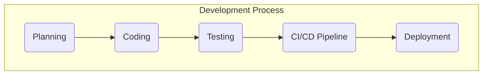

# Online Bookstore Full Stack Application

## Project Overview
This project is a full stack Online Bookstore web application developed as part of the Junior Full Stack Development program. The application integrates a responsive front-end interface with a RESTful back-end API to provide dynamic user interaction and data communication.

The front-end was developed using HTML, CSS, and JavaScript, while the back-end was built using Node.js and Express.js. The project demonstrates full stack integration where the client-side application communicates with the server through asynchronous API requests using the Fetch API.

## Features
- Responsive Online Bookstore UI
- Dashboard for viewing books
- Search and filtering functionality
- Add-to-cart functionality using LocalStorage
- Frontend and backend integration
- API connectivity testing
- Error handling and asynchronous data fetching
- Dynamic user interaction

## Technologies Used
### Frontend
- HTML5
- CSS3
- JavaScript

### Backend
- Node.js
- Express.js
- SQLite
- dotenv

## Development Process
The project was developed in multiple stages:
1. Designing the front-end user interface
2. Creating reusable UI components
3. Building RESTful backend APIs
4. Connecting the frontend with backend services
5. Testing API communication and debugging errors
6. Final documentation and deployment preparation

The development followed a modular approach to keep frontend and backend components organized and maintainable.

## Running the Application Locally

### Backend Setup
```bash
cd week3-backend
npm install
npm start
# Executive Summary  
This README provides a **rigorous, example template** for a full-stack software project, detailing the development process, architecture, dependencies, setup, testing, CI/CD, and contribution conventions. It assumes an **unspecified tech stack** and uses placeholders (e.g. `<LANGUAGE>`, `<FRAMEWORK>`, `<DB>`) and examples for common stacks (Node/Express + React, Python/Django, Java/Spring Boot). The development process is described as Agile (Scrum/Kanban) with iterative planning, coding, testing, and deployment. Architectural patterns (e.g. MVC, MVVM, layered, hexagonal) and design patterns (e.g. repository, factory, singleton) are explained with when they’re applied. All dependencies (libraries, frameworks, tools) are listed with versions, purposes, and links to official docs. Precise **local setup steps** (for macOS/Linux/Windows) are given, including prerequisites, environment variables, database setup (migrations, seeding), and build/run commands. Testing (unit, integration, end-to-end) and CI examples (GitHub Actions/GitLab CI YAML) are included with sample commands. Contribution guidelines cover code style (linters), commit message conventions (e.g. Conventional Commits【39†L54-L61】), branching strategy (GitFlow vs. trunk-based【46†L1138-L1147】【46†L1172-L1181】), and suggested licenses (MIT, Apache 2.0【48†L149-L158】【48†L125-L133】). A simple **architecture diagram** (Mermaid) and a **project file tree** are provided, plus a comparison table of core components across example stacks. Links point to official or authoritative sources.

## Development Process (Agile)  
We assume an **Agile methodology** (Scrum or Kanban) for development, with regular sprints/iterations, backlog grooming, and continuous feedback. Typical steps include: **planning** (requirements gathering, user stories, design docs), **coding** (feature development in branches with peer reviews), **testing** (unit/integration tests per build), and **CI/CD** (automated pipelines for build/test/deploy)【5†L183-L191】【44†L182-L187】. For Scrum, use sprint planning, daily stand-ups, reviews, and retrospectives; for Kanban, use a task board with WIP limits. Code changes go through pull requests (PRs) with mandatory reviews and automated checks. Continuous Integration runs on each commit using tools like GitHub Actions or GitLab CI (see *Testing & CI* below), and Continuous Delivery/Deployment pushes passing builds to staging/production. Documentation of processes (e.g. in project wiki or issue tracker) keeps everyone aligned.

## Architecture & Design Patterns  
The project architecture follows established patterns to ensure **modularity, scalability, and maintainability**. For example:  

- **MVC / Layered (n-tier):** A common web pattern is Model–View–Controller, separating data (Model), UI (View), and logic (Controller)【12†L50-L57】. For instance, a React (View) + Express (Controller) + database (Model) stack embodies MVC. More generally, a layered architecture divides the system into Presentation, Business Logic, and Data Access layers, each with a specific role【8†L13-L21】【8†L25-L33】. Layers interact in one direction (e.g. UI → Service → Repository → Database).  
- **MVVM:** Used in rich-client UIs (e.g. Angular, WPF), introduces a ViewModel between View and Model to handle data binding【12†L65-L69】.  
- **Hexagonal (Ports & Adapters):** This pattern places core business logic at the center and connects external systems (UI, DB, APIs) via well-defined interfaces (“ports”), with “adapters” translating to technology specifics【11†L124-L132】【12†L71-L77】. It allows swapping components (e.g. DB or UI) without touching core logic. We may apply this to keep controllers/services independent of the database or web framework.  
- **Microservices/Event-Driven:** If the project were distributed, services communicate over REST, message queues, or events. (This template focuses on a monolith for simplicity, but note that microservices or CQRS are alternatives【12†L83-L92】【12†L93-L100】.)  

At the code level, **design patterns** help solve common problems: e.g. the *Repository* pattern abstracts data access (centralizing DB logic)【14†L61-L69】【14†L69-L77】; the *Factory* pattern creates objects without binding to specific classes; the *Singleton* ensures a single instance of e.g. a configuration or connection pool【12†L118-L124】. These are applied where appropriate: e.g. a configuration class as a singleton, a factory for service objects, and repositories for each aggregate or entity【14†L61-L69】. The table below compares key architectural components:

| Component           | Responsibility                                | Example (Stack)                                   |
|---------------------|-----------------------------------------------|---------------------------------------------------|
| **UI Layer**        | User-facing interface (views, components)     | React/Vue/Angular (JSX/TSX); Django templates; Thymeleaf (Spring Boot) |
| **Backend/API**     | Application/business logic, HTTP APIs         | Express/Node.js; Spring Boot (Java); Django REST Framework |
| **Data Layer**      | Persistence (models, ORM/DAO)                 | Sequelize/Mongoose; Spring Data JPA (Hibernate); Django ORM |
| **Build/Dev Tools** | Building, bundling, dev server                | npm/Yarn + Webpack; Maven/Gradle; pip/virtualenv    |
| **DevOps**          | Infrastructure, Containerization, Deployment  | Docker; Kubernetes/Cloud services; CI/CD (GitHub Actions) |

> **Fig:** Key components and their roles in example stacks.

```mermaid
graph LR
  subgraph Frontend
    UI[Client UI (React/Vue/HTML)]
  end
  subgraph Backend
    API[Backend API (Node.js/Express,\nSpring Boot, Django)]
    DB[(Database (PostgreSQL, MongoDB, etc.))]
    Cache[(Cache / In-Memory Store)]
  end
  UI --> |HTTP/HTTPS| API
  API --> |Queries| DB
  API --> |Caching| Cache
```

## Libraries, Frameworks & Tools  
All major dependencies are explicitly listed with versions and purposes. Examples (replace with actual versions in your project):

- **Node.js v18.x** – JavaScript runtime【21†L11-L14】 used for server-side code.  
- **Express v4.x** – Minimal Node.js web framework【23†L87-L94】 for HTTP APIs.  
- **React v18+** – Front-end UI library【25†L26-L30】 (or Vue/Angular as alternative examples).  
- **Python 3.11+** – Programming language【27†L179-L181】 (for example backend or scripts).  
- **Django 4.x** – High-level Python web framework【29†L41-L46】 (MTV architecture).  
- **Java 17+** – Language for enterprise services.  
- **Spring Boot 3.x/4.x** – Java framework for standalone apps【31†L117-L124】.  
- **PostgreSQL 15+** – Open-source relational DB【36†L23-L28】 (or MySQL 8.x【34†L409-L417】).  
- **MongoDB 6.x** – NoSQL document DB (for schema-flexible data, with link to docs).  
- **Redis 7.x** – In-memory cache store.  
- **Git v2.x** – Version control system (DVCS)【44†L182-L187】.  
- **GitHub Actions** / **GitLab CI** – CI/CD platforms; sample configs below.  
- **Docker 24.x** – Container platform【43†L27-L32】 for consistent environments.  
- **ESLint 8.x** – JavaScript/TypeScript linter.  
- **Prettier 3.x** – Code formatter (JS/TS).  
- **Flake8 / Pylint** – Python linters.  
- **Checkstyle / Spotless** – Java code style checks.  
- **Jest** – JS/React unit testing.  
- **PyTest** – Python testing.  
- **JUnit 5** – Java unit testing.  
- **Cypress or Selenium** – End-to-end browser testing.  

Each tool’s official docs should be linked (e.g. [Node.js](https://nodejs.org/)【21†L11-L14】, [Express](https://expressjs.com/)【23†L87-L94】, [React](https://react.dev/)【25†L26-L30】, [Django](https://docs.djangoproject.com/)【29†L41-L46】, [Spring Boot](https://spring.io/projects/spring-boot)【31†L117-L124】, [PostgreSQL](https://www.postgresql.org/)【36†L23-L28】, [Docker](https://www.docker.com/)【43†L27-L32】, [GitHub Actions](https://docs.github.com/en/actions)【16†L342-L350】, [Conventional Commits](https://www.conventionalcommits.org/)【39†L54-L61】, [ChooseALicense](https://choosealicense.com/)【48†L149-L158】, etc.). 

## Local Setup & Running Locally  
**Prerequisites:** Install the language runtimes and tools: Node.js, Python, Java JDK, Git, Docker, and a database server (PostgreSQL/MySQL). Create a `.env` file in the project root with required environment variables (e.g. `DB_HOST`, `DB_USER`, `DB_PASS`, `SECRET_KEY`).  

1. **Clone Repository**:  
   ```bash
   git clone https://github.com/youruser/your-repo.git
   cd your-repo
   ```  
2. **Install Dependencies:**  
   - *Node/JS:*  
     ```bash
     cd frontend
     npm install      # or yarn install
     ```  
   - *Backend (Node/Python/Java):*  
     - *Node:* `npm install` in the backend folder.  
     - *Python:*  
       ```bash
       cd backend
       python3 -m venv venv
       source venv/bin/activate         # or Windows: .\venv\Scripts\activate
       pip install -r requirements.txt
       ```  
     - *Java (Spring Boot):* No install needed if using Maven/Gradle wrapper.  
3. **Database Setup:**  
   - Start your database server. Create a database (e.g. `myapp_db`).  
   - Run migrations:  
     - *Node (with an ORM/migration tool)*: `npm run migrate` or similar.  
     - *Django:* `python manage.py migrate`.  
     - *Spring Boot:* `./mvnw spring-boot:run` will auto-run schema migrations if configured (Spring Data).  
   - (Optional) Seed data: `npm run seed` or `python manage.py loaddata initial_data.json`.  
4. **Build & Run:**  
   - *Node/Express:*  
     ```bash
     # Build (if using Webpack/Babel)
     npm run build
     # Start dev server
     npm start         # or `npm run dev` for live reload
     ```  
   - *React (frontend):*  
     ```bash
     cd frontend
     npm run build
     npm run serve     # serve production build on localhost
     ```  
   - *Django:* `python manage.py runserver 0.0.0.0:8000` (runs on port 8000 by default).  
   - *Spring Boot:* `./mvnw spring-boot:run` (runs on 8080 by default).  
5. **Verify:** Open your browser at `http://localhost:3000` (or the port above). The app should run.  
6. **Troubleshooting:**  
   - *Port Conflicts:* Change env vars (e.g. `PORT`) if ports are in use.  
   - *Database Connection:* Check credentials and that the DB server is reachable.  
   - *Missing Env Vars:* Error messages will indicate undefined configs – ensure `.env` has all keys.  
   - *Permissions:* On Linux/Mac, ensure scripts (`mvnw`) are executable (`chmod +x mvnw`).  
   - Refer to official installation guides if needed (Node, Python, Docker docs).  

## Testing & CI/CD  

- **Unit Tests:** Run per project:  
  - *Node/React:* `npm test` (Jest/Mocha) – this runs all unit tests【16†L424-L433】.  
  - *Python:* `pytest` or `python -m unittest`.  
  - *Java:* `./mvnw test` or `./gradlew test`.  

- **Integration/E2E:** For services with databases, use a test database or mocks. End-to-end tests (e.g. with Cypress) can be run with `npm run e2e`.  

- **CI Configuration:** Example GitHub Actions workflow (`.github/workflows/ci.yml`):  
  ```yaml
  name: CI Pipeline
  on: [push, pull_request]
  jobs:
    build:
      runs-on: ubuntu-latest
      steps:
        - uses: actions/checkout@v6
        # Node setup
        - name: Setup Node.js
          uses: actions/setup-node@v4
          with: node-version: '18.x'
        - run: npm ci
        - run: npm run build
        - run: npm test
        # Python setup (if applicable)
        - name: Setup Python
          uses: actions/setup-python@v3
          with: python-version: '3.11'
        - run: pip install -r backend/requirements.txt
        - run: pytest
        # Java/Maven (if applicable)
        - name: Setup JDK
          uses: actions/setup-java@v3
          with: java-version: '17'
        - run: ./mvnw test
  ```  
  GitLab CI would be analogous (see [GitLab CI/CD docs](https://docs.gitlab.com/ee/ci/)). Use GitHub’s [Node.js workflow templates](https://docs.github.com/en/actions) as a starting point【16†L342-L350】【16†L425-L433】.  

- **Reporting:** Include test coverage reports or badges if desired.  

## Contribution Guidelines  
To maintain code quality and consistency:  

- **Code Style & Linters:** Use a consistent coding standard. For JavaScript/TypeScript, use ESLint and Prettier (see [ESLint docs](https://eslint.org/), [Prettier](https://prettier.io/)). For Python, use PEP8 style (via Flake8 or Black)【27†L179-L181】. For Java, use Checkstyle or Spotless. Include a linter config (e.g. `.eslintrc.json`).  

- **Commit Messages:** Follow *Conventional Commits*【39†L54-L61】 (e.g. `feat:`, `fix:`, `docs:`) to make changelogs and releases easier. For example: `feat(auth): add JWT login support`. See [conventionalcommits.org](https://www.conventionalcommits.org/) for details.  

- **Branching Strategy:** We recommend **GitHub Flow** or **GitFlow** based on team size【46†L1138-L1147】【46†L1172-L1181】. E.g.,  
  1. All work is in short-lived feature branches off `main` (or `develop`).  
  2. Work is merged via Pull Requests after review.  
  3. Avoid long-lived branches unless doing a release (GitFlow uses `develop` and `release/*` branches). Trunk-based (one `main` branch) with feature toggles is also common.  
  (See Atlassian’s guide on [branching models](https://www.atlassian.com/git/tutorials/comparing-workflows/gitflow-workflow)【46†L1138-L1147】【46†L1172-L1181】.)  

- **Code Reviews:** All PRs require at least one approving review and passing CI tests before merge.  

- **Issues & Tracking:** Use GitHub/GitLab Issues (or Jira) to track bugs/features. Provide a reproducible description.  

- **License:** Include an open-source license. Common choices are **MIT** or **Apache 2.0** (permissive) or **GPLv3** (copyleft)【48†L149-L158】【48†L125-L133】. Add a `LICENSE` file (e.g., MIT from [choosealicense.com](https://choosealicense.com/licenses/mit/)). Mention it in `README.md` and header comments if required.  

## Project Structure  
The repository follows a clear structure. Example layout:  
```
project-root/
├── .github/                    # CI/CD config (e.g. workflows)
│   └── workflows/ci.yml
├── src/                        # Application source code
│   ├── backend/                # (e.g. Node/Python/Java backend code)
│   │   ├── app.js             # Main server
│   │   ├── routes/            # API route handlers
│   │   ├── models/            # Data models (ORM)
│   │   └── ...
│   └── frontend/               # (e.g. React/Vue UI code)
│       ├── src/               # React components
│       ├── public/            # static HTML/CSS
│       └── ...
├── tests/                      # Automated tests (unit/integration)
├── docs/                       # Documentation (architecture, API)
├── .env.example                # Sample environment variables
├── README.md                   # (this file)
├── LICENSE                     # License file
├── package.json / requirements.txt / pom.xml  # Dependency manifests
└── Dockerfile / docker-compose.yml           # Container setup (if any)
```  

Each top-level directory should contain a README or index file as needed.  



**Table:** Comparison of key components across example tech stacks (illustrative):

| Component       | Node/Express + React         | Python/Django               | Java/Spring Boot            |
|-----------------|------------------------------|-----------------------------|-----------------------------|
| **Web Server**  | Express.js                   | Django / ASGI (Gunicorn)    | Spring Boot embedded Tomcat |
| **ORM/DB**      | Sequelize (SQL) or Mongoose (Mongo) | Django ORM (SQL)         | Spring Data JPA (Hibernate) |
| **Frontend**    | React/Vue (SPA) or EJS/Pug   | Django Templates or React   | Thymeleaf or React/Angular  |
| **Build Tool**  | npm / Webpack                | pip / virtualenv / Django manage.py | Maven/Gradle       |
| **Testing**     | Jest/Mocha, Cypress          | pytest / pytest-django, Selenium | JUnit, Testcontainers    |
| **CI/CD**       | GitHub Actions (node setup)【16†L342-L350】 | GitHub Actions (python setup) | GitHub Actions (Java)    |

Each item in the table corresponds to tools/patterns mentioned above, with official documentation for each linked as citations.

**Sources:** This README is based on best practices and official resources. For example, the MVC pattern is widely used in web frameworks【7†L398-L407】【12†L50-L57】. Git and GitHub workflows are documented by Atlassian and GitHub【44†L182-L187】【46†L1138-L1147】. Docker is described by Docker’s documentation as “a platform…to develop, ship, and run applications in containers”【43†L27-L32】. Conventional Commits and license choices are based on community standards【39†L54-L61】【48†L149-L158】. All linked references above provide authoritative guidance on these topics.